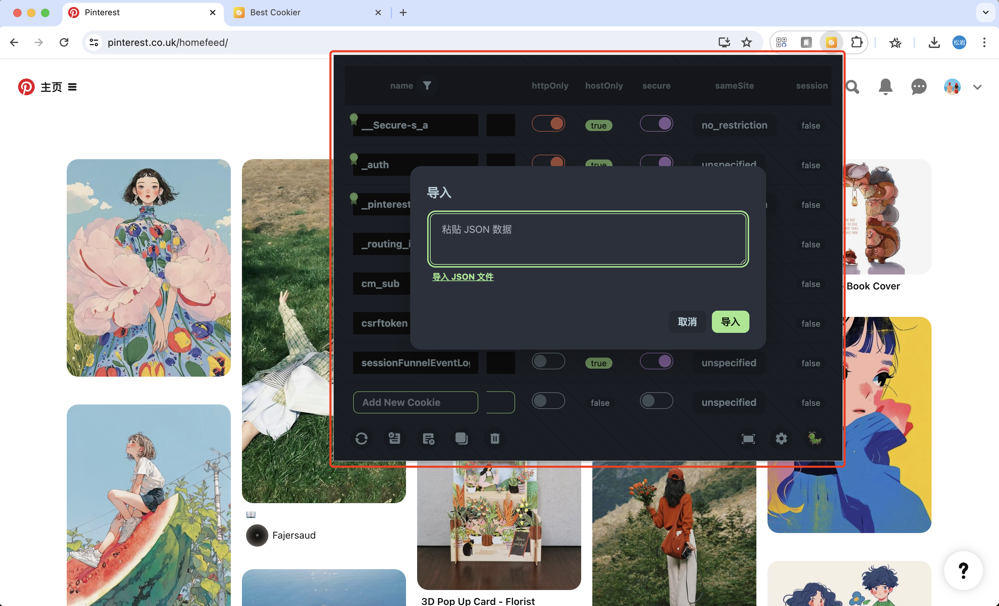
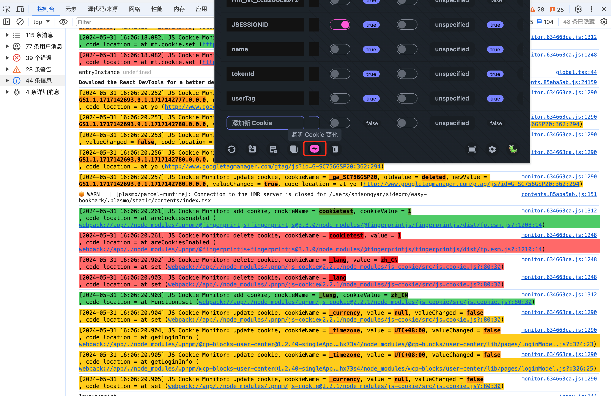

# Best Cookier

[Chrome Web Store](https://chromewebstore.google.com/detail/best-cookier/eijnnomioacbbnkffmhnbpbocoajcage) A high-quality cookie manager that integrates beauty, functionality, and ease of use.

English | [简体中文](https://github.com/Dolov/chrome-best-cookier/blob/main/README.md)

### ⚠️⚠️⚠️ Disclaimer
Browser cookies are highly private, and some websites use cookies for login authentication. If your cookies are stolen, it is equivalent to someone else logging into your account. Recently, it was reported that a prominent figure in the cryptocurrency community had $1 million stolen because another browser extension stole their cookies. Therefore, some bloggers on X have labeled this plugin as malicious. Being inexperienced is the original sin; I only regret not discovering this business opportunity earlier 🤣🤣🤣.

Therefore, it is still recommended that users with such needs fork the repository and build and install it themselves, which isn't too complicated.

### Features
- Convenient add, delete, modify, and search functionalities.
- Monitor all JavaScript actions that change cookies and print them to the console (beneficial for frontend developers).
- Import/export from/to files, copy, delete, full-screen operation, batch operations.
- Support for retrieving cookies from all subdomains under the root domain.
- Support for searching multiple columns such as name, value, domain, path, etc.
- Support for "following" a specific cookie, with special highlighting.
- 32 exquisite theme colors, gradient background colors, multiple follow icons – whatever you desire.

### Feature Examples

#### Normal Theme Mode

#### Dark Theme Mode

#### Import

#### Monitor all JavaScript actions that change cookies

#### Full-Screen Mode

#### Theme Configuration

#### Follow Icon Configuration

### Welcome to Use
If you encounter any issues during use or have new feature requests, feel free to provide feedback in the issues section.

### Thanks
- https://github.com/JSREI/js-cookie-monitor-debugger-hook
