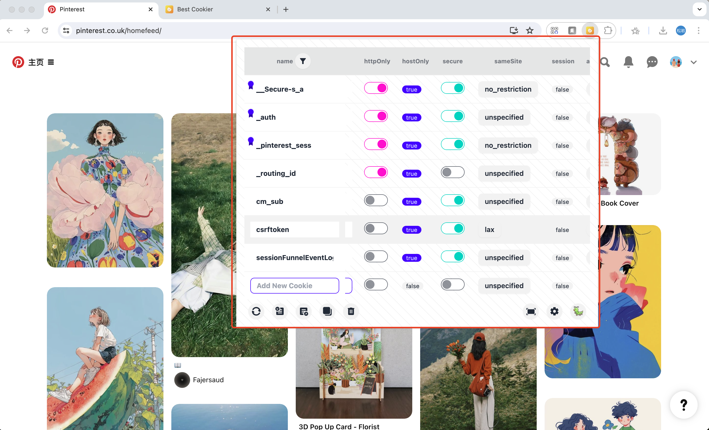
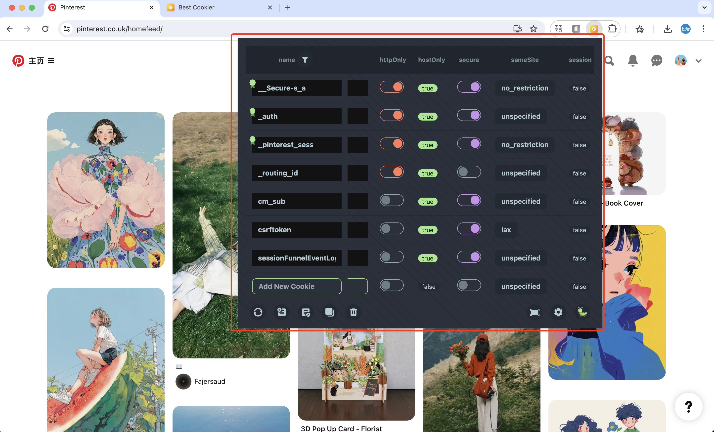
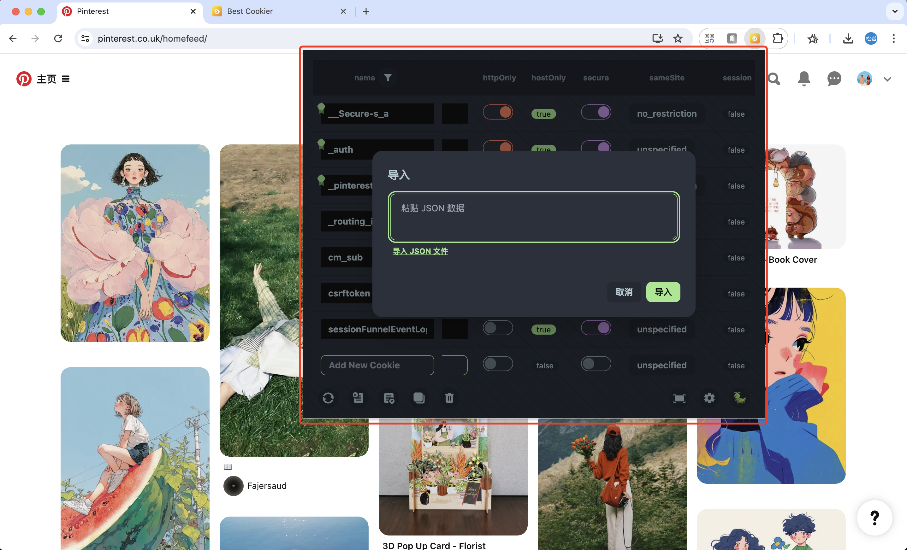
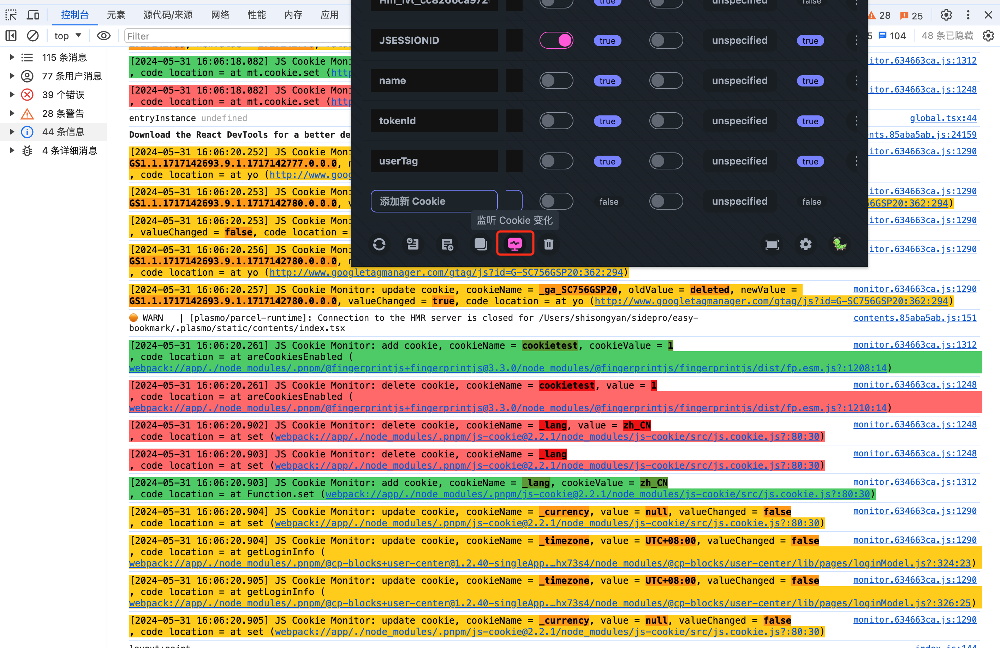
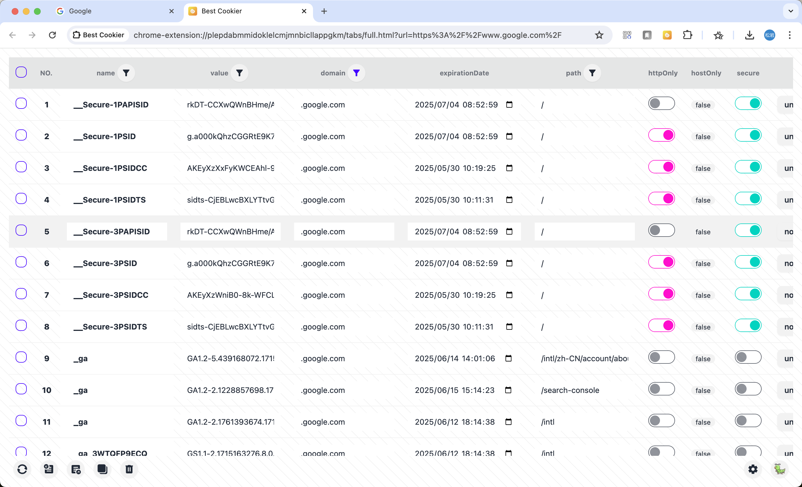
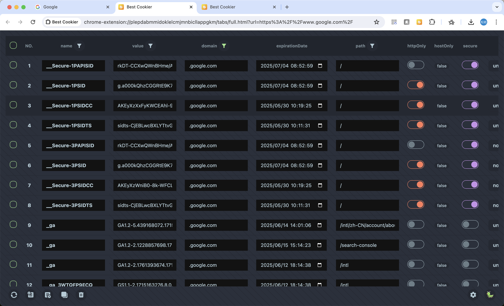
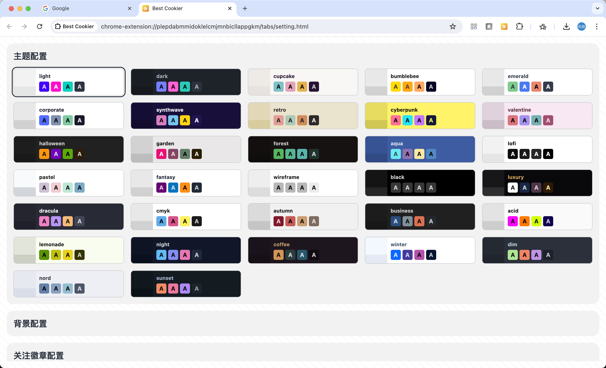
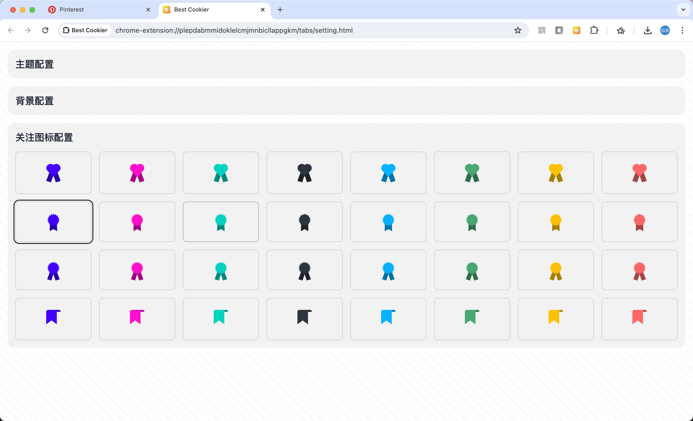

# Best Cookier

[chrome web store](https://chromewebstore.google.com/detail/best-cookier/eijnnomioacbbnkffmhnbpbocoajcage) 一款集颜值、操作、功能于一体的高质量 Cookie 管理器。

[English](https://github.com/Dolov/chrome-best-cookier/blob/main/README.en-US.md) | 简体中文

### ⚠️⚠️⚠️ 声明
浏览器 cookie 隐私性较高，有些网站的登录授权都是通过 cookie 来实现的，被窃取了 cookie 相当于被别人登录了账号。
恰巧近几天爆出有币圈大佬因被其他浏览器扩展窃取 cookie 而被盗取 100w 刀，所以在 X 上有些博主将该插件定性为恶意扩展。
菜是原罪，只怪自己没提前发现这个商机 🤣🤣🤣。

在此呢还是建议有需求的用户能够 fork 一下仓库，自己构建安装一下，也不算麻烦。

### 功能
- 便捷的增、删、改、查。
- 监控所有 JS 操作 cookie 变化的动作并打印在控制台上（前端开发者利好）。
- 文件导入、导出为文件、复制、删除、全屏操作、批量操作。
- 支持检索根域名下所有子域名的 Cookie。
- 支持 name、value、domain、path 等多列数据检索。
- 支持 “关注” 某 cookie，置顶特殊显示。
- 支持 “Cookie 安全卫士”，用户可以配置在访问某些站点时，禁用某些扩展，离开时激活。
- 支持无痕模式。
- 32 款精致主题色、N 款背景渐变色、多个关注图标 你想要的样子我都有。

### 功能示例

#### 正常主题模式

#### 暗色主题模式

#### 导入

#### 监控所有 JS 操作 cookie 变化的动作

#### 全屏模式

#### 主题配置

#### 关注图标配置

### 欢迎使用
使用过程中遇到问题或者有新功能的需求可以在 issues 中进行反馈。

### 开发构建
1. 安装 nodejs https://nodejs.org/en/download/package-manager
2. npm i
3. npm build
4. npm package

### 鸣谢
- https://github.com/JSREI/js-cookie-monitor-debugger-hook
