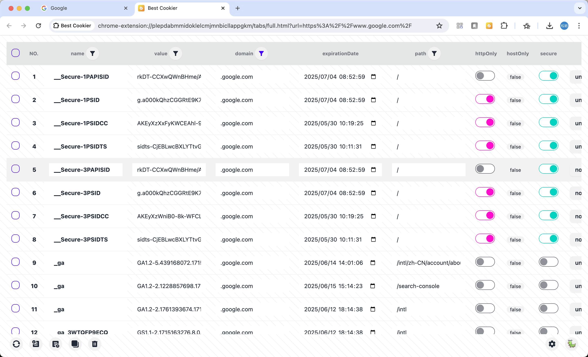

# Best Cookier

[chrome web store](https://chromewebstore.google.com/detail/best-cookier/eijnnomioacbbnkffmhnbpbocoajcage) 一款集颜值、操作、功能与一体的高质量 Cookie 管理器。

[English](https://github.com/Dolov/chrome-best-cookier/blob/main/README.md) | 简体中文

### 功能
- 便捷的增、删、改、查。
- 监控所有 JS 操作 cookie 变化的动作并打印在控制台上。
- 文件导入、导出为文件、复制、删除、全屏操作、批量操作。
- 支持检索根域名下所有子域名的 Cookie。
- 支持 name、value、domain、path 等多列数据检索。
- 支持 “关注” 某 cookie，置顶特殊显示。
- 32 款精致主题色、N 款背景渐变色、多个关注图标 你想要的样子我都有。

### 功能示例

#### 正常主题模式

#### 暗色主题模式

#### 导入

#### 全屏模式

#### 主题配置

#### 关注图标配置

### 欢迎使用
使用过程中遇到问题或者有新功能的需求可以在 issues 中进行反馈。
